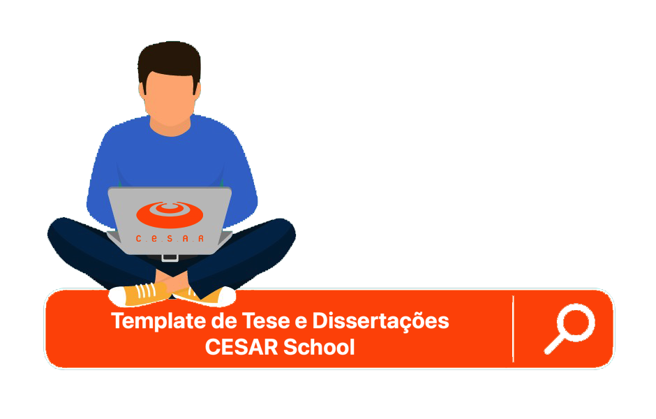
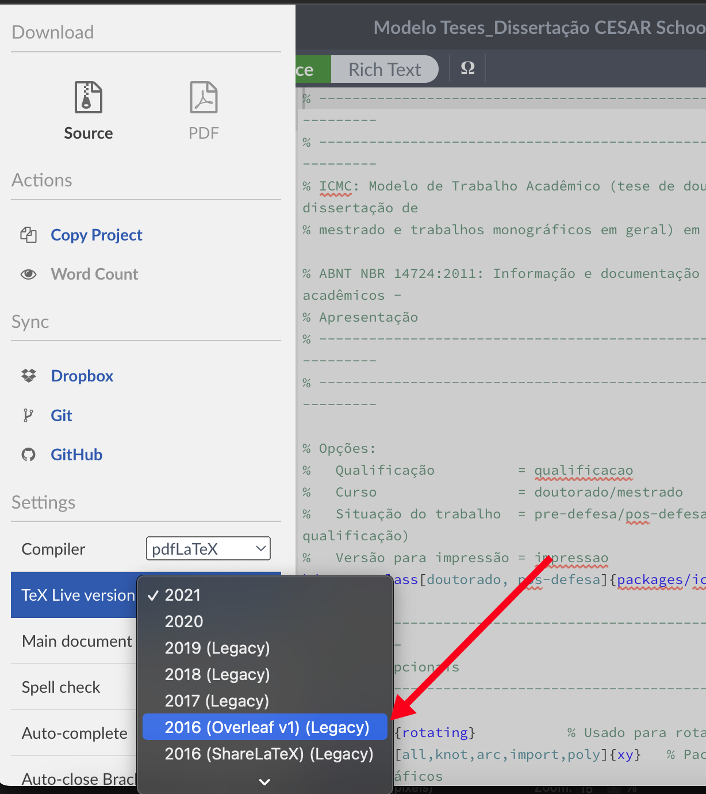
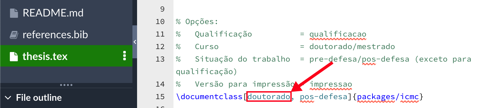
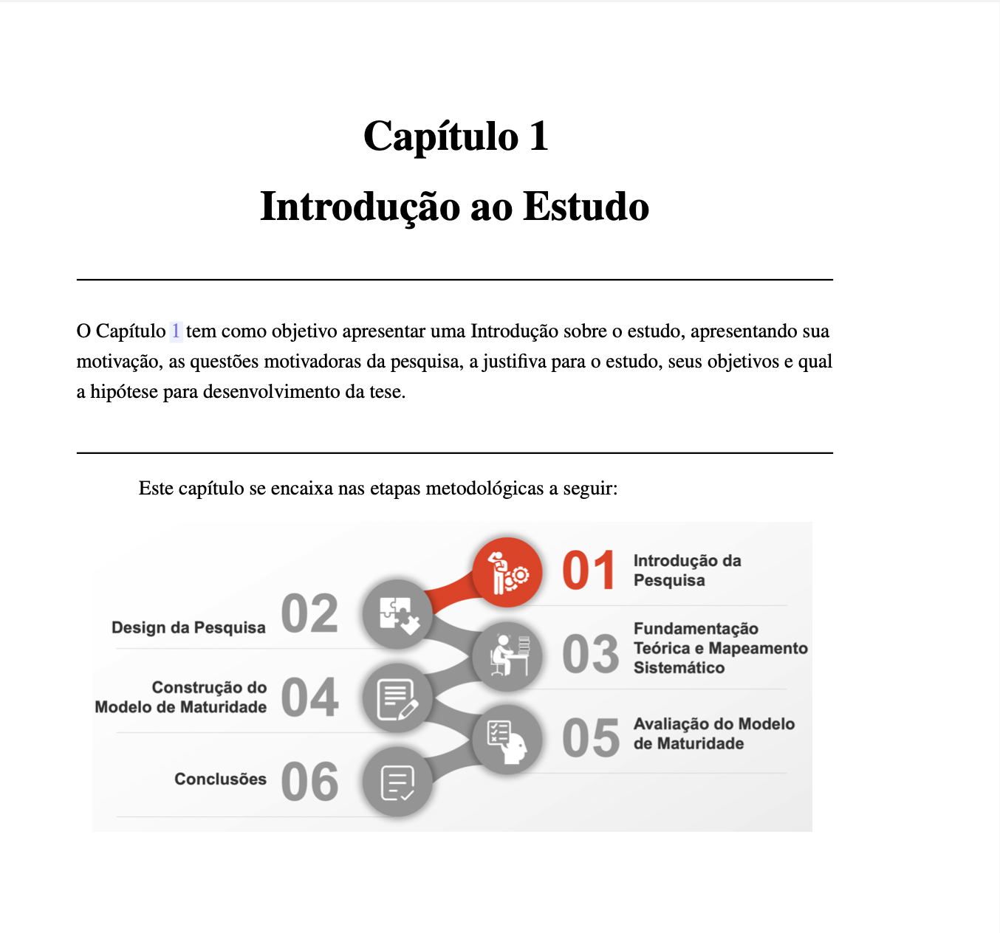

<p align="center"></p>

Este modelo, adaptado a partir do template da <a href="https://www.overleaf.com/latex/templates/modelo-de-teses-e-dissertacoes-icmc-slash-usp/cvqdvbnxjqts" target="_blank" rel="noopener noreferrer" title="Por favor, clique com o botão direito do mouse para abrir em uma nova guia">ICMC/USP</a>, visa atender as exigências dos Programas de Pós-Graduação da CESAR School. O presente template encontra-se aderente ao que preconiza a Associação Brasileira de Normas Técnicas (ABNT), todavia com algumas adaptações em relação aos estilos dos capítulos, capa e folhas de rostos.

## Parametrização para Compilação
O requisito básico para utilização da classe **_icmc_** é criar um documento desta classe com o comando
`\documentclass[@parameters]{icmc}` e ter, no diretório de trabalho, o arquivo *icmc.cls* presente. Entretanto, recomenda-se fortemente manter a estrutura de diretório inicial fornecida por este modelo.<

Para que o documento esteja em conformidade com as normas exigidas pelo programa de Pós-Graduação, o **projeto deve ser compilado utilizando *pdfLaTeX*** e versão ***2016 (Overleaf v1) (Legacy)***. Para isso acesse o Menu do overleaf e parametrize o documento conforme imagem abaixo:
<p align="center"></p>

O documento pode ser utilizado tanto para os programas de Mestrado como para o de Doutorado, dentro da pasta `\packages`, encontra-se os arquivos <b>capa-doutorado.pdf</b> e <b>capa-mestrado.pdf</b>, renomei o arquivo conforme seu programa de pós-graduação para <b>capa.pdf</b>.

Com a finalidade de que o documento fique todo parametrizado segundo o seu programa de pós-graduação altere ainda o arquivo <b>thesis.tex</b>, conforme parâmetros e imagem descritos a seguir: 

- **[qualificacao]** Exclusivamente para monografias de qualificação em geral;
- **[mestrado / doutorado]** Identifica o curso ao qual o aluno pertence, sendo utilizado apenas uma das duas opcões disponíveis. O valor padrão é **doutorado**;
- **[pre-defesa / pos-defesa]** Identifica a situação do documento (exceto para qualificação), sedo necessário apenas uma das duas opções. O valor padrão é **pos-defesa**;
- **[impressao]** Gera exclusivamente uma versão para impressão do documento;
- **[french, spanish, english, brazil]** Adiciona o idioma para correta hifenização correta no documento. Os idiomas bases para o modelo (português e inglês) não precisam ser declarados.

<p align="center"></p>

## Estrutura do Documento

- **`\images`** A presente diretório é destinado a consolidar todas as imagens da pesquisa, por questão de organização crie subdiretórios para as imagens de cada capítulo.

- **`\packages`** contem o arquivo <b>icmc.cls</b> que contem todas as configurações e estrutura do projeto, o subdiretório  `\packages\fonts` com todas as fontes utilizadas no projeto e, por fim, os arquivos utilizados na capa e contra-capa;

- **`\tex`** este diretório concentra todos os subdiretórios e arquivos, referente a escrita do projeto, organizado por anexos `\tex\annex`, capítulos `\tex\chapters`, capa do capítulo `\tex\part`, apêndices `\tex\appendix`, elementos pré-textuais `\tex\pre-textual`.

- **`\modelos_compilados`** este diretório não possui relação com o projeto, foi utilizado somente para disponibilizar os modelos já commpilados tanto de [tese](\modelos_compilados\Modelo_Teses_CESAR_School.pdf) como da [dissertação](\modelos_compilados\Modelo_Dissertação_CESAR_School.pdf).

- **`\anexo`**  o presente diretório é utilizado para disponibilizar o ppt que contém as imagens utilizadas na capa de cada capítulo, para que o pesquisador possa alterar conforme seu estudo e gerar uma nova imagem, conforme exemplo abaixo:

<p align="center"></p>

## Formatação Documento

Para entender melhor sobre formatação do texto no Overleaf [Clique aqui](format-overleaf.md)
<details>
  <summary markdown="span">**Formatação Própria do Projeto**</summary>

##### Para citações indiretas "Autor (ano)" utilize "citeonline"

Exemplo: Segundo \citeonline{referencia}, texto

```ruby
Resultado:
   Segundo João (2020), texto...
```
##### Para gerar abreviaturas automáticas utilize "\sigla{abreviatura}{significado abreviatura}"  

Exemplo: \sigla{AWS}{Amazon Web Services}

```ruby
Resultado:
   AWS Amazon Web Service.
```
  
</details>  